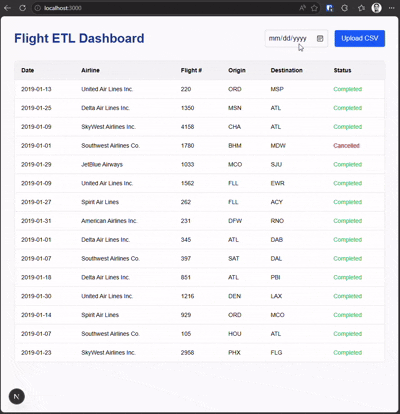
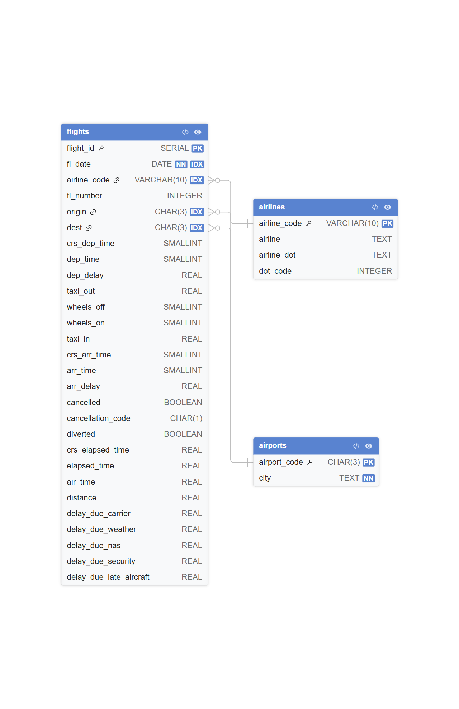

# ✈️ Flight Data ETL Project

A full-stack data engineering project that ingests flight CSV data into a PostgreSQL database using a Spring Boot ETL pipeline and displays results via a Next.js UI. 

*Note: Docker is used exclusively to run the PostgreSQL 16 Alpine database instance. The frontend and backend run locally.*

---

## 📊 Dataset Attribution

The flight data used in this project is sourced from Kaggle:
[Flight Delay and Cancellation Dataset (2019-2023)](https://www.kaggle.com/datasets/patrickzel/flight-delay-and-cancellation-dataset-2019-2023)

---

## 🎥 Application Demo



---

## 🧱 Tech Stack

- **Backend:** Spring Boot (Java)
- **Database:** PostgreSQL 16 Alpine (via Docker)
- **Frontend:** Next.js (React)
- **ETL:** CSV ingestion via Spring Boot

---

## 📊 Architecture Overview

```text
CSV File Upload            Local Directory Polling (/data/schedule)
      ↘                              ↙
         Spring Boot ETL API
                  ↓
    PostgreSQL Database (Docker)
                  ↓
         Next.js Frontend UI
```

---

## 📁 Project Structure

```text
flight-app/
│
├── backend/demo/   # Spring Boot ETL + API
│   └── data/
│       └── schedule/ # Drop CSVs here for auto-ingestion
├── frontend/       # Next.js UI
├── database/       # SQL init scripts
└── README.md
```

---

## 🗄️ Database Schema



* **airlines**: Carrier metadata
* **airports**: Airport + city mapping
* **flights**: Main fact table with delay metrics and foreign keys

---

## 🚀 Running Locally

### 1. Prerequisites
- Docker Desktop installed (for Postgres)
- Java 17+ 
- Node.js 18+ 
- Maven 

### 2. Database
Ensure your PostgreSQL 16 Alpine container is running and accessible at `localhost:5432`.

### 3. Backend
Navigate to the backend directory and run the Spring Boot application:
```bash
cd backend\demo
mvn spring-boot:run
```

### 4. Frontend
Navigate to the frontend directory, install dependencies, and start the development server:
```bash
cd frontend
npm install
npm run dev
```

---

## 🔌 Current Backend API Endpoints

### 1. Upload CSV
* **Endpoint:** `POST http://localhost:8080/api/flights/upload`
* **Request:** `multipart/form-data` with the file attached in the body under the key `file`.
* **Description:** Parses the CSV, normalizes airlines and airports, and inserts flights into the database.

### 2. Fetch Flights
* **Endpoint:** `GET http://localhost:8080/api/flights`
* **Query Parameters:** `?date=YYYY-MM-DD` (Optional)
* **Example:** `GET http://localhost:8080/api/flights?date=2019-01-01`
* **Description:** Returns a JSON list of flight records, optionally filtered by a specific date.

---

## ⏱️ Scheduled Ingestion (Auto-ETL)

In addition to manual HTTP uploads, the backend features a scheduled task that polls a local directory for new CSV files every 5 minutes.

* **Directory Path:** `backend/demo/data/schedule`
* **De-duplication:** The system calculates a SHA-256 hash of each file. It maintains an in-memory list of processed hashes to ensure a file is never ingested twice, even if it remains in the folder.

---

## ⚙️ Environment Variables

Backend (`application.properties`):

```properties
spring.datasource.url=jdbc:postgresql://localhost:5432/flightdb
spring.datasource.username=flightuser
spring.datasource.password=flightpass
```

---

## 🧠 Key Features

* CSV-based ETL pipeline
* Automated 5-minute polling with SHA-256 file hashing to prevent duplicate ingestion
* Airline and airport normalization
* Relational schema design
* Next.js Client Components with API integration
* Modular Spring Boot architecture

---

## 📌 Notes

* Designed for learning Spring Boot + ETL concepts
* Not optimized for production scale ingestion
* Focus is correctness + clarity over performance

---

## 📈 Future Improvements

* Batch inserts for ETL performance
* Pagination for flight queries
* Filtering by airline/airport
* Charts in frontend (delays, routes)
* Authentication layer
* Async ingestion queue